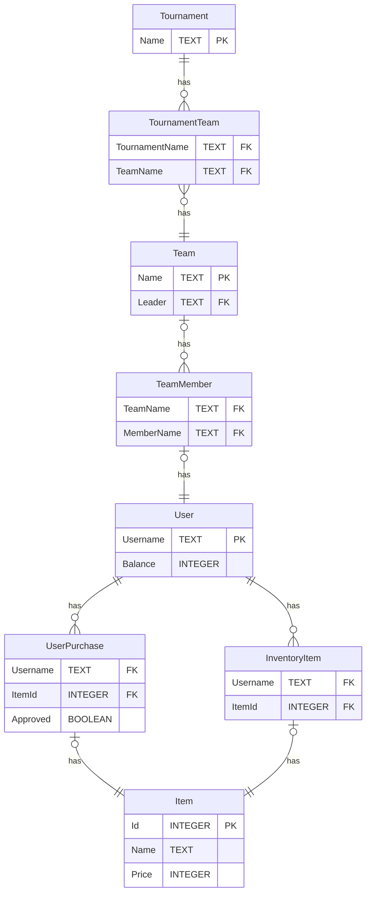

```mermaid
erDiagram
    user[User] {
        Username TEXT PK
        Balance INTEGER
    }
    
    userpurchase[UserPurchase] {
        Username TEXT FK
        ItemId INTEGER FK
        Approved BOOLEAN
    }

    item[Item] {
        Id INTEGER PK
        Name TEXT
        Price INTEGER
    }

    inventoryitem[InventoryItem] {
        Username TEXT FK
        ItemId INTEGER FK
    }


    team[Team] {
        Name TEXT PK
        Leader TEXT FK
    }

    teammember[TeamMember] {
        TeamName TEXT FK
        MemberName TEXT FK
    }

    tournament[Tournament] {
        Name TEXT PK
    }

    tournamentteam[TournamentTeam] {
        TournamentName TEXT FK
        TeamName TEXT FK
    }

    
    user ||--o{ userpurchase: has
    user ||--o{ inventoryitem: has
    userpurchase |o--|| item: has
    inventoryitem |o--|| item: has

    team |o--o{ teammember: has
    teammember |o--|| user: has

    tournament ||--o{ tournamentteam: has
    tournamentteam }o--|| team: has
```